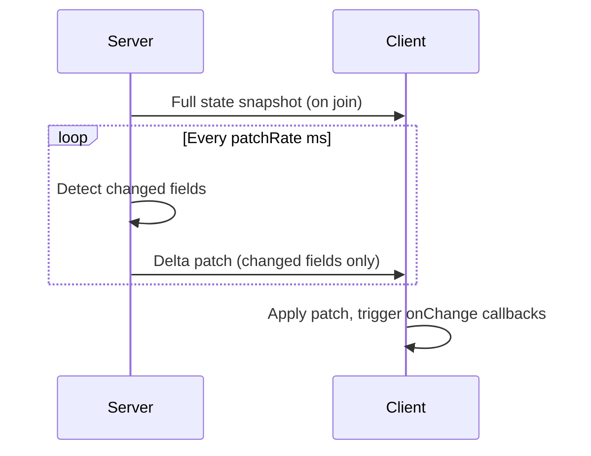

`@colyseus/schema` is the binary serialization library Colyseus uses to keep game state synchronized between server and clients. It sends only the differences (delta patches) between state snapshots, minimizing bandwidth.

## Installation

```bash
npm install @colyseus/schema
```

`@colyseus/schema` is a peer dependency of `@colyseus/core`. You only need to install it separately if you're importing it directly in a package that doesn't depend on core.

---

## Basic example

```typescript
import { Schema, type } from "@colyseus/schema";

class GameState extends Schema {
  @type("number") score = 0;
  @type("string") phase = "waiting";
  @type("boolean") isRunning = false;
}
```

Assign it to your room's `state`:

```typescript
class MyRoom extends Room<{ state: GameState }> {
  async onCreate() {
    this.state = new GameState();
  }
}
```

The framework automatically detects the Schema instance, serializes the initial state on client join, and sends delta patches on every `patchRate` interval.

---

## Primitive types

All primitive type strings accepted by the `@type()` decorator:

| Type string | JavaScript type | Size | Notes |
|-------------|----------------|------|-------|
| `"string"` | `string` | variable | UTF-8 encoded |
| `"number"` | `number` | variable | Encoded as the smallest integer that fits, or float64 |
| `"boolean"` | `boolean` | 1 byte | |
| `"int8"` | `number` | 1 byte | -128 to 127 |
| `"uint8"` | `number` | 1 byte | 0 to 255 |
| `"int16"` | `number` | 2 bytes | -32768 to 32767 |
| `"uint16"` | `number` | 2 bytes | 0 to 65535 |
| `"int32"` | `number` | 4 bytes | -2³¹ to 2³¹−1 |
| `"uint32"` | `number` | 4 bytes | 0 to 2³²−1 |
| `"int64"` | `bigint` | 8 bytes | Use `BigInt` in JavaScript |
| `"uint64"` | `bigint` | 8 bytes | Use `BigInt` in JavaScript |
| `"float32"` | `number` | 4 bytes | Single-precision float |
| `"float64"` | `number` | 8 bytes | Double-precision float |

<Tip>
Use the smallest type that fits your data range. `"uint8"` for a 0–255 counter uses 8× less bandwidth than `"number"` when the value is large.
</Tip>

---

## Nested schemas

You can nest `Schema` classes inside each other. Assign the constructor directly to `@type()`:

```typescript
class Vector2 extends Schema {
  @type("float32") x = 0;
  @type("float32") y = 0;
}

class Player extends Schema {
  @type("string") name = "";
  @type(Vector2) position = new Vector2();
}

class GameState extends Schema {
  @type({ map: Player }) players = new MapSchema<Player>();
}
```

---

## Collections

Use `MapSchema`, `ArraySchema`, and `SetSchema` for synchronized collections. Standard JavaScript `Map`, `Array`, and `Set` are **not** tracked and will not send changes to clients.

```typescript
import { Schema, type, MapSchema, ArraySchema } from "@colyseus/schema";

class GameState extends Schema {
  @type({ map: Player }) players = new MapSchema<Player>();
  @type({ array: "number" }) scores = new ArraySchema<number>();
}
```

See [Schema Collections](/api/schema/collections) for the full API.

---

## How state synchronization works



1. When a client joins, it receives a full serialized snapshot of the current state.
2. On every patch interval (default 50ms), the serializer computes which fields changed since the last patch.
3. Only changed fields are encoded and sent.
4. The client SDK decodes the patch and updates its local state copy, triggering `onChange` callbacks.

---

## TypeScript decorator configuration

`@colyseus/schema` supports both legacy TypeScript decorators (TypeScript < 5.0 with `experimentalDecorators: true`) and modern Stage 3 decorators.

<Tabs>
  <Tab title="Modern decorators (TS 5+)">
    ```json
    // tsconfig.json
    {
      "compilerOptions": {
        "target": "ES2022",
        "experimentalDecorators": false
      }
    }
    ```

    Stage 3 decorators require `Symbol.metadata` to be available (Node.js 22+ or a polyfill).
  </Tab>
  <Tab title="Legacy decorators (TS 4)">
    ```json
    // tsconfig.json
    {
      "compilerOptions": {
        "experimentalDecorators": true,
        "emitDecoratorMetadata": false
      }
    }
    ```
  </Tab>
</Tabs>
